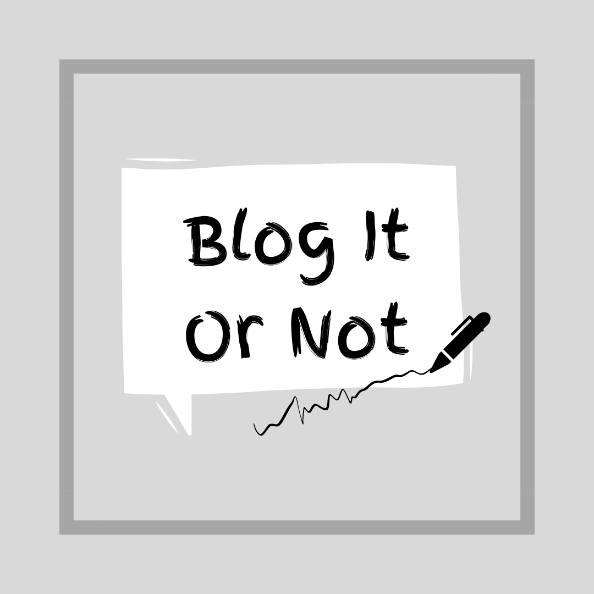
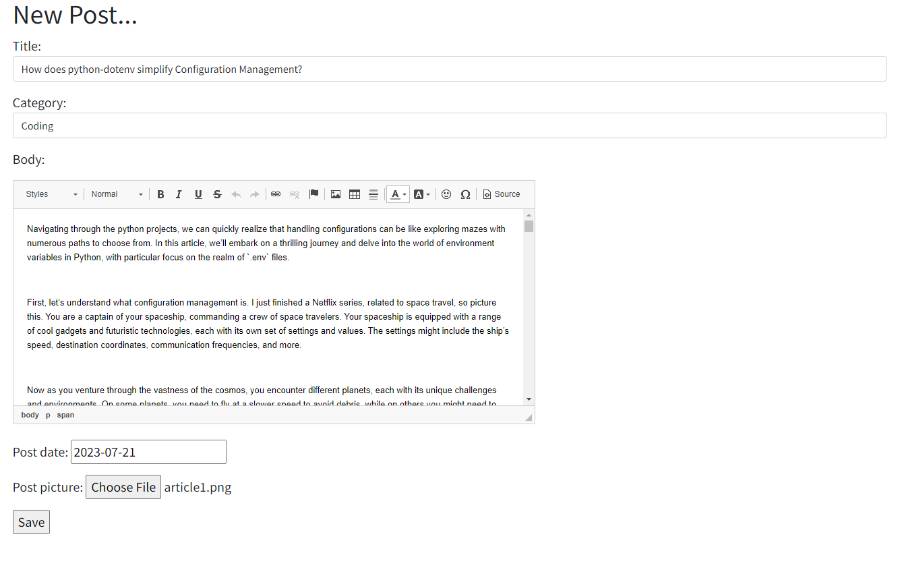
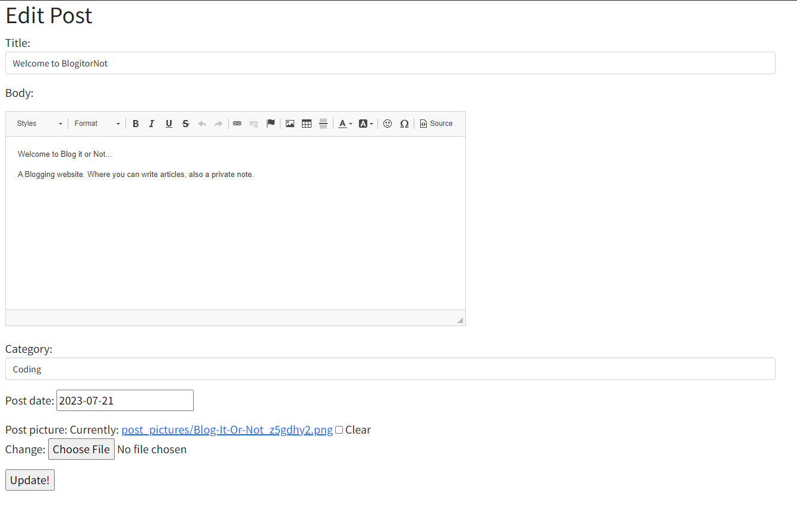
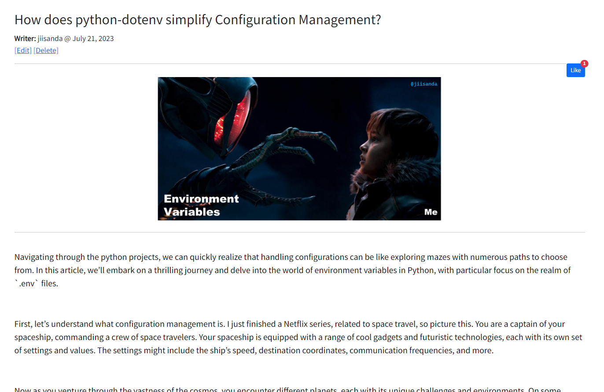
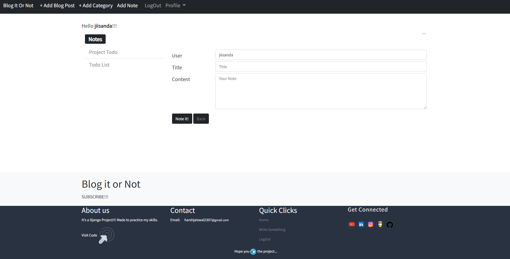
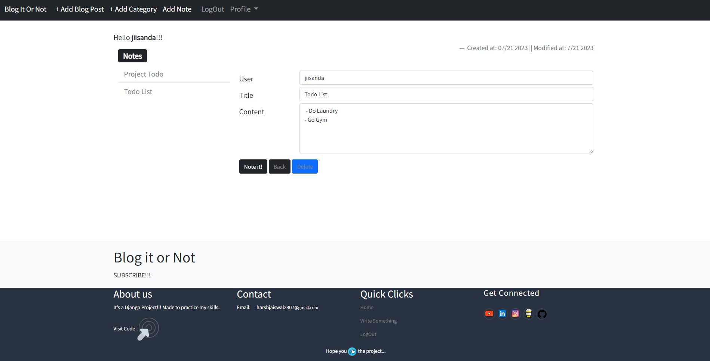
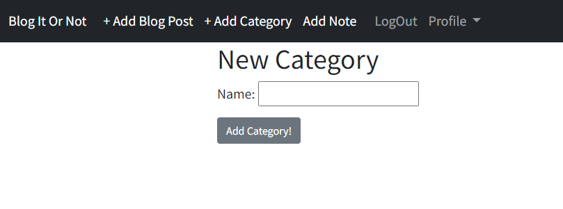
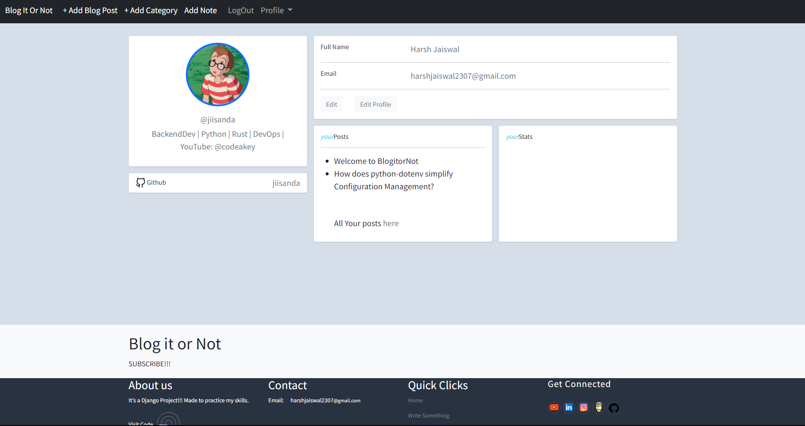

<br />
<div align="center">
  <a href="https://github.com/jiisanda/blogitornot">
    
  </a>

  <h3 align="center">Blog It or Not</h3>

  <p align="center">
    A Blogging application, with private notes.
    <br />
    <a href="https://github.com/jiisanda/blogitornot"><strong>Explore the docs »</strong></a>
  </p>
</div>

---

#### 📥 Installation

```
git clone https://github.com/jiisanda/BlogitOrnot.git
pip install -r requirements.txt
```

#### ⚙️ Setup
```
python3 manage.py makemigrations
python3 manage.py migrate
python3 manage.py migrate --run-syncdb
```

#### 🖌️ Create Superuser
Superuser can be created to access the django admin
```
python3 manage.py createsuperuser
```
Enter the asked fields...

#### 🎬 Screenshots

|  | 
|:--:| 
| *Home Page with List View* |

|  | 
|:--:| 
| *Add a new Post* |

|  |
|:--:|
| *Edit Post* |

|  |
|:--:|
| *Detail View of a Post* |

|  |
|:--:|
| *Add a Note* |

|  |
|:--:|
| *Update a note* |

|  |
|:--:|
| *Add a Blog Category* |

|  |
|:--:|
| *User Profile Page* |

#### 📜 LICENSE
This project is licensed under the MIT License - see the [LICENSE](LICENSE) file for details.

